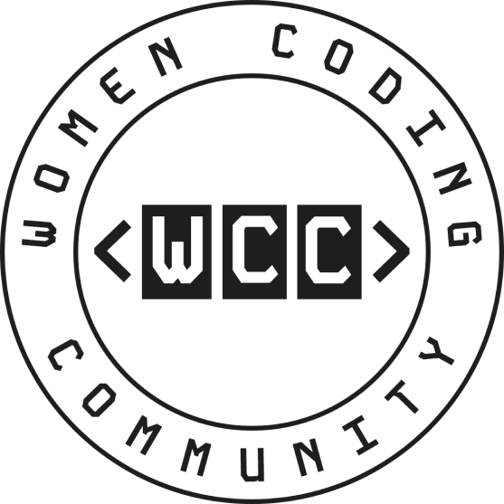

<div style="display: flex; justify-content:center; padding-bottom: 50px">
  
</div>

[![Contributors][contributors-shield]][contributors-url]
[![Forks][forks-shield]][forks-url]
[![Issues][issues-shield]][issues-url]
[![Stargazers][stars-shield]][stars-url]

[contributors-shield]: https://img.shields.io/github/contributors/women-coding-community/wcc-frontend.svg
[contributors-url]: https://github.com/women-coding-community/wcc-frontend/pulse/contributors
[forks-shield]: https://img.shields.io/github/forks/women-coding-community/wcc-frontend.svg
[forks-url]: https://github.com/women-coding-community/wcc-frontend/network/members
[issues-shield]: https://img.shields.io/github/issues/women-coding-community/wcc-frontend.svg
[issues-url]: https://github.com/women-coding-community/wcc-frontend/issues
[stars-shield]: https://img.shields.io/github/stars/women-coding-community/wcc-frontend.svg
[stars-url]: https://github.com/women-coding-community/wcc-frontend/stargazers

# WCC Frontend Application

This is the FE application (NextJS) for Women Coding Community website.

## Requirements

- Node (20+)
- [Pnpm](https://pnpm.io/) (v9+)

If you don't have pnpm you can install it with npm running

```bash
npm install -g pnpm@9
```

## Installation

Install project dependencies

```bash
  pnpm install
```

## Development

You can run the application using

```bash
  pnpm dev
```

## Contribution

You can run these commands pre-commit, but the application uses husky which will run
checks before you can commit.

```bash
  pnpm lint:fix && pnpm format && pnpm type-check
```

TODO: add contribution rules in contribution.md
