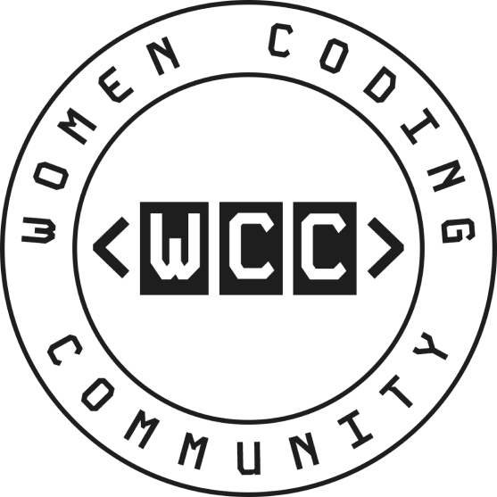

<div style="display: flex; justify-content:center; padding-bottom: 50px">
  
</div>

[![Contributors][contributors-shield]][contributors-url]
[![Forks][forks-shield]][forks-url]
[![Issues][issues-shield]][issues-url]
[![Stargazers][stars-shield]][stars-url]

[contributors-shield]: https://img.shields.io/github/contributors/women-coding-community/wcc-frontend.svg
[contributors-url]: https://github.com/women-coding-community/wcc-frontend/pulse/contributors
[forks-shield]: https://img.shields.io/github/forks/women-coding-community/wcc-frontend.svg
[forks-url]: https://github.com/women-coding-community/wcc-frontend/network/members
[issues-shield]: https://img.shields.io/github/issues/women-coding-community/wcc-frontend.svg
[issues-url]: https://github.com/women-coding-community/wcc-frontend/issues
[stars-shield]: https://img.shields.io/github/stars/women-coding-community/wcc-frontend.svg
[stars-url]: https://github.com/women-coding-community/wcc-frontend/stargazers

# WCC Frontend Application

This is the FE application (NextJS) for Women Coding Community website.

## How to contribute?

See our [Contributing](./CONTRIBUTING.md) page.

## Requirements for running on your machine

- Node (20+)
- [Pnpm](https://pnpm.io/) (v9+)

If you don't have node, go to [their downloads page](https://nodejs.org/en/download).

If you don't have pnpm you can install it with npm running

```bash
npm install -g pnpm@9
```

Then, install project dependencies

```bash
  pnpm install
```

Next, create an `.env.local` file in your root folder. In this file please paste the following:

```
API_BASE_URL=http://localhost:8080/api/cms/v1
API_KEY=local
```

`.env.local` is git-ignored and never committed.

You also need a backend running at that address — see [Running the whole application with Docker](#running-the-whole-application-with-docker).

Now you can run the application using

```bash
  pnpm dev
```

You can run also these commands pre-commit for your peace of mind. The application uses husky, which will run these same checks before you can commit.

```bash
  pnpm lint:fix && pnpm format && pnpm type-check
```

For running unit tests, you can use this command:

```bash
  pnpm test
```

Use this one to run playwright (e2e) tests:

```bash
  pnpm test:e2e
```

For running e2e tests in a Docker container (recommended for consistency across environments):

```bash
  pnpm run test:e2e:docker
```

This uses Docker Compose to run Playwright tests in an isolated container, as the CI does. It also retries 3 times, as the CI does.

To run an _individual_ test, one can also pass grep parameters with the test title such as:

```bash
  pnpm run test:e2e:docker -g "Validate footer"
```

To update visual regression snapshots (when UI changes are intentional):

```bash
  pnpm run test:e2e:docker:update
```

This updates the reference screenshots used in visual tests.

## Running the whole application with Docker

One command starts the whole platform — database, API, admin portal and this website — already wired together and seeded with test data. Good for seeing everything working together, or for end-to-end testing.

### 1. Get the backend code

The Docker setup lives in the backend repository, and it builds this website from your local checkout — so the two need to sit side by side. From inside this repo:

```bash
cd ..
git clone https://github.com/Women-Coding-Community/wcc-backend.git
```

You should end up with:

```
├── wcc-frontend   ← this repository
└── wcc-backend
```

If the two repos aren't side by side, point the stack at GitHub instead:

```bash
WCC_FRONTEND_CONTEXT=https://github.com/Women-Coding-Community/wcc-frontend.git ./scripts/app-stack.sh up
```

This builds the published version of the website, not your local changes.

### 2. Start everything

With Docker Desktop running:

```bash
cd wcc-backend
./scripts/app-stack.sh up
```

The first run builds the images and takes several minutes. Later runs are quicker.

### 3. Open it

The command prints these when it finishes:

| What          | URL                                         |
| ------------- | ------------------------------------------- |
| This website  | http://localhost:3001                       |
| Backend API   | http://localhost:8080                       |
| Swagger UI    | http://localhost:8080/swagger-ui/index.html |
| Admin portal  | http://localhost:3000                       |
| MailHog inbox | http://localhost:8025                       |

### Seeded accounts

Six accounts are created, all with the password `wcc-admin`:

| Email                      | Role               | What it's for                          |
| -------------------------- | ------------------ | -------------------------------------- |
| `admin@wcc.dev`            | `ADMIN`            | Widest access — start here             |
| `mentorship-admin@wcc.dev` | `MENTORSHIP_ADMIN` | Approves mentors, manages matches      |
| `leader@wcc.dev`           | `LEADER`           |                                        |
| `mentor@wcc.dev`           | `MENTOR`           | The long-term mentor shown on the site |
| `mentor-adhoc@wcc.dev`     | `MENTOR`           | The ad-hoc mentor                      |
| `member@wcc.dev`           | `VIEWER`           |                                        |

This website has no login. You use these accounts for the **admin portal**, where you can change the content the site shows. Those two mentor accounts are what you see on `/mentorship/mentors`.

### Switching the mentorship cycle

The website's mentors page (`http://localhost:3001/mentorship/mentors`) filters by the open
cycle's mentorship type when it first loads. With the default long-term cycle you'll see one
mentor. Switch the cycle to see the others. No restart is needed; just reload the page.

```bash
./scripts/app-stack.sh cycle ad-hoc      # the ad-hoc mentor
./scripts/app-stack.sh cycle none        # no open cycle — all mentors show
./scripts/app-stack.sh cycle long-term   # back to the default
```

### Stopping

```bash
./scripts/app-stack.sh down
```

> If `pnpm dev` is running, stop it first. The admin portal needs port 3000, and the stack won't start while it's taken.

> The website here is a production build, so it won't pick up your code changes. Use `pnpm dev` for day-to-day development. This setup is for seeing the whole application running.

[`docs/qa_local_setup.md`](https://github.com/Women-Coding-Community/wcc-backend/blob/main/docs/qa_local_setup.md) in the backend repository covers the database and troubleshooting.

## CI/CD and deploy (Vercel)

The website frontend is deployed to Vercel using Vercel's native Git integration on pushes to `main`.

Configure the following environment variables in the Vercel project dashboard:

- `API_BASE_URL` (Backend API URL, e.g. `https://wcc-backend-prod.fly.dev/api/cms/v1`)
- `API_KEY` (Backend API key)
